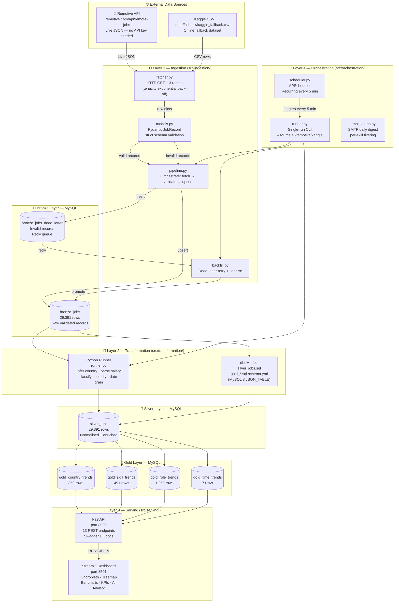
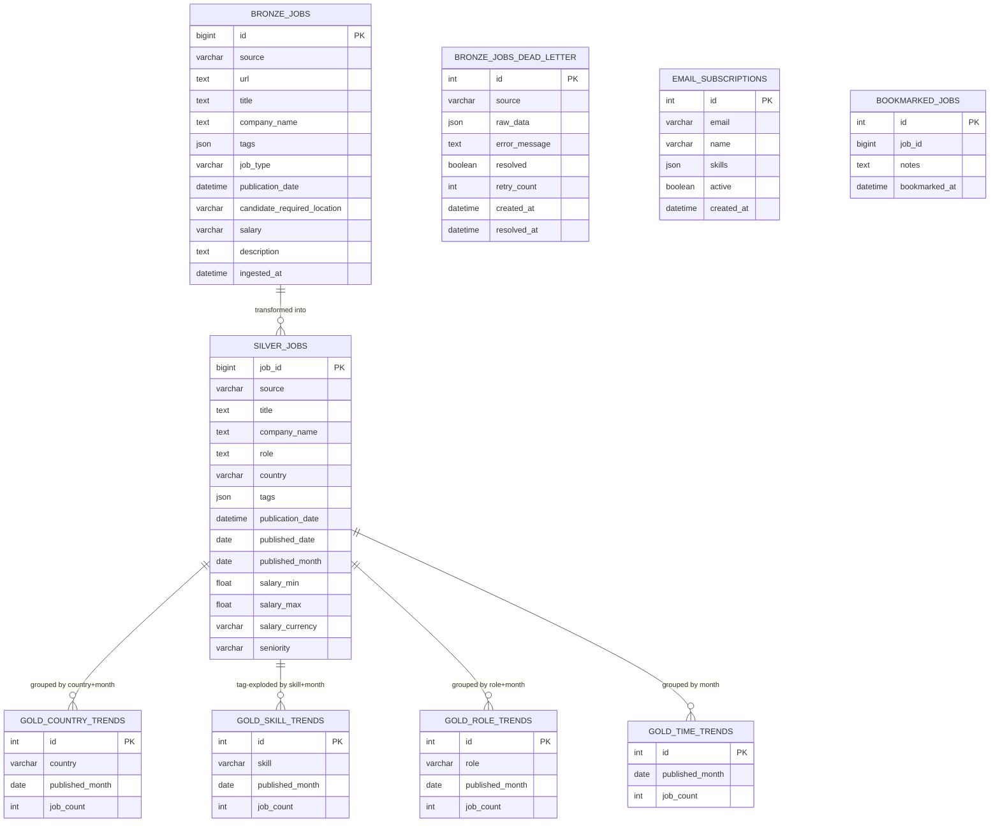

# CareerLens — Architecture & Diagrams

---

## 1. Full Pipeline Flow



---

## 2. Database Entity-Relationship Diagram



---

## 3. Data Journey — Explained Simply

| Step | What Happens | Input | Output |
|---|---|---|---|
| **1. Fetch** | Call Remotive API over the internet | URL request | Raw JSON |
| **2. Validate** | Check every field with Pydantic | Raw JSON | Valid / Invalid records |
| **3. Store Bronze** | Save valid records to MySQL | Valid records | `bronze_jobs` table |
| **4. Dead-letter** | Save invalid records separately | Invalid records | `bronze_jobs_dead_letter` |
| **5. Backfill** | Try to fix & retry invalid records | Dead-letters | Promoted to `bronze_jobs` |
| **6. Enrich** | Infer country, parse salary, classify seniority | `bronze_jobs` | `silver_jobs` |
| **7. Aggregate** | Count jobs by country / skill / role / month | `silver_jobs` | 4 Gold tables |
| **8. Serve API** | FastAPI reads gold tables → returns JSON | Gold tables | REST responses |
| **9. Visualise** | Streamlit calls API → renders charts | REST JSON | Dashboard |

---

## 4. Technology Stack at a Glance

| Layer | Technology | What It Does |
|---|---|---|
| **Data Collection** | `requests` + `tenacity` | HTTP calls with automatic retry |
| **Validation** | `Pydantic v2` | Type-safe schema enforcement |
| **Database ORM** | `SQLAlchemy 2.0` | Python ↔ MySQL mapping |
| **Database** | `MySQL 8.0` | Stores all 9 tables, 60,899 rows |
| **Transformation** | `Python` + `dbt-mysql` | Clean, aggregate, enrich data |
| **REST API** | `FastAPI` + `uvicorn` | 13 endpoints, auto Swagger docs |
| **Dashboard** | `Streamlit` + `Plotly` | Interactive charts & maps |
| **Scheduling** | `APScheduler` | Runs pipeline every 5 minutes |
| **Email Alerts** | `smtplib` (SMTP) | Daily job digest emails |
| **AI Features** | `Google Gemini 1.5` | Resume analysis & job matching |
| **Containerisation** | `Docker Compose` | One-command full stack deploy |
| **CI/CD** | `GitHub Actions` | Auto test on every code push |
| **Testing** | `pytest` + `pytest-cov` | Unit & integration tests |
| **Code Quality** | `black` + `ruff` | Auto formatting & linting |
| **Config** | `pydantic-settings` + `.env` | Secure environment config |

---

## 5. API Endpoints Map

```
http://localhost:8000/
│
├── /health                          ← Is the server alive?
├── /docs                            ← Interactive Swagger UI
│
├── /api/v1/
│   ├── stats                        ← KPIs: total jobs, countries, skills
│   │
│   ├── trends/
│   │   ├── countries?limit&month    ← Gold: jobs by country
│   │   ├── skills?limit&month       ← Gold: jobs by skill/technology
│   │   ├── roles?limit&month        ← Gold: jobs by role title
│   │   └── time?limit               ← Gold: monthly job count
│   │
│   ├── jobs?page&source&seniority   ← Bronze: paginated job browser
│   │
│   ├── salary/
│   │   ├── by-role?currency         ← Avg salary per role
│   │   ├── by-country?currency      ← Avg salary per country
│   │   └── currencies               ← Available currencies
│   │
│   ├── bookmarks/                   ← GET / POST / DELETE
│   ├── subscriptions/               ← POST email alert subscription
│   ├── unsubscribe/                 ← DELETE subscription
│   └── ai/recommend                 ← POST resume → AI job matches
```

---

## 6. Live System Stats (MySQL — right now)

| Metric | Value |
|---|---|
| 🗄️ Database | MySQL 8.0 — `careerlens` |
| 📋 Bronze jobs | **29,391** job postings |
| ✨ Silver jobs | **29,391** enriched records |
| 🌍 Countries tracked | **359** country/region combinations |
| 🔧 Skills tracked | **491** unique skills |
| 👔 Role types | **1,259** unique role titles |
| 📅 Time coverage | **7 months** of data |
| 📦 Total rows | **60,899** across all tables |
| ⚡ Migration speed | 60,899 rows in **8.2 seconds** |
| 🚀 API | Running on `http://localhost:8000` |
| 📊 Dashboard | Running on `http://localhost:8501` |

---

## 7. How to Run Everything

```bash
# 1. Activate virtual environment
venv\Scripts\activate

# 2. Run the full pipeline once (fetch + transform + backfill)
python -m src.orchestration.runner --source all

# 3. Start the API server
python -m uvicorn src.serving.api.main:app --port 8000

# 4. Start the dashboard (new terminal)
python -m streamlit run src/serving/dashboard/app.py

# --- OR run everything at once ---
python run.py

# --- OR deploy with Docker ---
docker compose up --build
```
