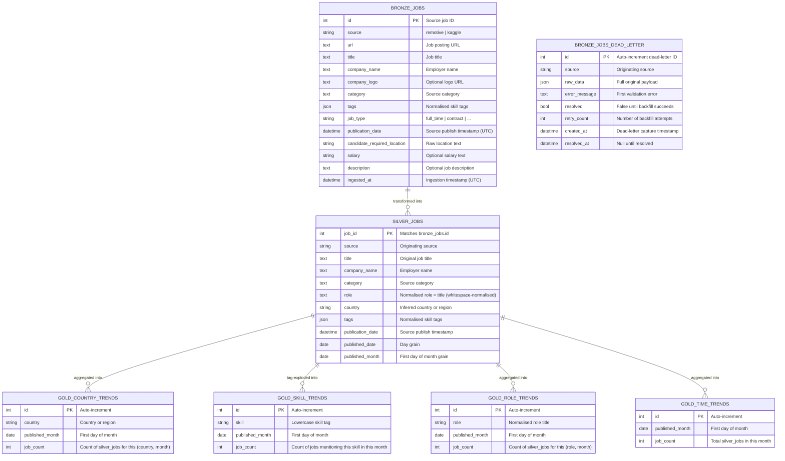

# CareerLens — Data Model

**Version:** 1.0.0
**Updated:** June 2026

---

## 1. Architecture Overview: Medallion Layers

CareerLens implements the **Medallion Architecture** pattern — data flows through three quality layers, each progressively more refined:

```
External Sources                 Bronze               Silver              Gold
─────────────────    ─────────────────────    ──────────────    ──────────────────
Remotive API     ──► bronze_jobs            ──► silver_jobs ──► gold_country_trends
Kaggle CSV       ──► bronze_jobs_dead_letter                ──► gold_skill_trends
                                                            ──► gold_role_trends
                                                            ──► gold_time_trends
```

- **Bronze**: Raw, validated records — schema-enforced but otherwise unmodified.
- **Silver**: Normalised records — country inferred, date grain added, tags normalised.
- **Gold**: Pre-aggregated metrics — one row per (dimension, month) combination.

---

## 2. Entity-Relationship Diagram



---

## 3. Table Specifications

### 3.1 Bronze Layer

#### `bronze_jobs`

Stores one row per unique remote job posting. Records are upserted (merged by primary key) on each pipeline run to ensure idempotency.

| Column | Type | Nullable | Constraints | Notes |
|---|---|---|---|---|
| `id` | INTEGER | No | PRIMARY KEY | Source-assigned job ID |
| `source` | VARCHAR(50) | No | DEFAULT 'remotive' | `remotive` or `kaggle` |
| `url` | TEXT | No | — | Must start with `http://` or `https://` |
| `title` | TEXT | No | — | Trimmed, non-blank |
| `company_name` | TEXT | No | — | Trimmed, non-blank |
| `company_logo` | TEXT | Yes | — | Optional logo URL |
| `category` | TEXT | Yes | — | Source-assigned category |
| `tags` | JSON | No | DEFAULT `[]` | List of lowercase skill strings |
| `job_type` | VARCHAR(50) | Yes | — | e.g. `full_time`, `contract` |
| `publication_date` | TIMESTAMPTZ | No | — | Normalised to UTC |
| `candidate_required_location` | VARCHAR(200) | Yes | — | Raw location string from source |
| `salary` | VARCHAR(100) | Yes | — | Free-text salary information |
| `description` | TEXT | Yes | — | Full HTML/text job description |
| `ingested_at` | TIMESTAMPTZ | No | DEFAULT now() | Pipeline write timestamp |

#### `bronze_jobs_dead_letter`

Captures records that failed Pydantic validation during ingestion. Used by the backfill process.

| Column | Type | Nullable | Constraints | Notes |
|---|---|---|---|---|
| `id` | INTEGER | No | PRIMARY KEY, AUTOINCREMENT | Internal dead-letter ID |
| `source` | VARCHAR(50) | No | — | Originating source |
| `raw_data` | JSON | No | — | Full original payload at time of failure |
| `error_message` | TEXT | No | — | First validation error message |
| `resolved` | BOOLEAN | No | DEFAULT false | Set to true when backfill succeeds |
| `retry_count` | INTEGER | No | DEFAULT 0 | Incremented on each failed retry |
| `created_at` | TIMESTAMPTZ | No | DEFAULT now() | Dead-letter capture timestamp |
| `resolved_at` | TIMESTAMPTZ | Yes | — | Set when `resolved = true` |

---

### 3.2 Silver Layer

#### `silver_jobs`

One row per unique job posting, enriched with inferred location and time grain fields.

| Column | Type | Nullable | Notes |
|---|---|---|---|
| `job_id` | INTEGER | No | PRIMARY KEY; matches `bronze_jobs.id` |
| `source` | VARCHAR(50) | No | Originating source |
| `title` | TEXT | No | Original job title |
| `company_name` | TEXT | No | Employer name |
| `category` | TEXT | Yes | Source category |
| `role` | TEXT | No | Whitespace-normalised job title |
| `country` | VARCHAR(120) | No | Inferred from `candidate_required_location`; `"Unknown"` or `"Global"` when unresolvable |
| `tags` | JSON | No | Normalised lowercase skill tag list |
| `publication_date` | TIMESTAMPTZ | No | Source publish timestamp (UTC) |
| `published_date` | DATE | No | Day grain |
| `published_month` | DATE | No | First day of the month — primary aggregation grain |

**Country inference rules:**
1. Null / empty → `"Unknown"`
2. Contains "worldwide" or "global" (case-insensitive) → `"Global"`
3. Contains a comma → last comma-separated segment (trimmed)
4. Otherwise → full trimmed string

---

### 3.3 Gold Layer

All gold tables are **fully refreshed** on each transformation run (truncate + insert). They are pre-aggregated for fast API serving.

#### `gold_country_trends`

| Column | Type | Nullable | Notes |
|---|---|---|---|
| `id` | INTEGER | No | AUTO PK |
| `country` | VARCHAR(120) | No | Country or region |
| `published_month` | DATE | No | First day of month |
| `job_count` | INTEGER | No | `COUNT(*)` from silver grouped by (country, month) |

#### `gold_skill_trends`

| Column | Type | Nullable | Notes |
|---|---|---|---|
| `id` | INTEGER | No | AUTO PK |
| `skill` | VARCHAR(120) | No | Lowercase tag |
| `published_month` | DATE | No | First day of month |
| `job_count` | INTEGER | No | `COUNT(*)` — each job contributes one row per tag per month |

#### `gold_role_trends`

| Column | Type | Nullable | Notes |
|---|---|---|---|
| `id` | INTEGER | No | AUTO PK |
| `role` | VARCHAR(200) | No | Normalised role title |
| `published_month` | DATE | No | First day of month |
| `job_count` | INTEGER | No | `COUNT(*)` from silver grouped by (role, month) |

#### `gold_time_trends`

| Column | Type | Nullable | Notes |
|---|---|---|---|
| `id` | INTEGER | No | AUTO PK |
| `published_month` | DATE | No | First day of month (UNIQUE in practice) |
| `job_count` | INTEGER | No | Total `COUNT(*)` from silver for this month |

---

## 4. Data Lineage

```
bronze_jobs
    │
    ├── (country inference + date grain + tag normalisation)
    │
    ▼
silver_jobs
    │
    ├── GROUP BY country, published_month   ──► gold_country_trends
    ├── UNNEST tags, GROUP BY skill, month  ──► gold_skill_trends
    ├── GROUP BY role, published_month      ──► gold_role_trends
    └── GROUP BY published_month           ──► gold_time_trends
```

---

## 5. Indexes and Constraints

| Table | Index / Constraint | Purpose |
|---|---|---|
| `bronze_jobs` | PRIMARY KEY (`id`) | Upsert target |
| `bronze_jobs_dead_letter` | `resolved`, `created_at` | Efficient backfill queries |
| `silver_jobs` | PRIMARY KEY (`job_id`) | Merge target |
| `gold_country_trends` | `(country, published_month)` | API filter queries |
| `gold_skill_trends` | `(skill, published_month)` | API filter queries |
| `gold_role_trends` | `(role, published_month)` | API filter queries |
| `gold_time_trends` | `published_month` | Chronological ordering |
